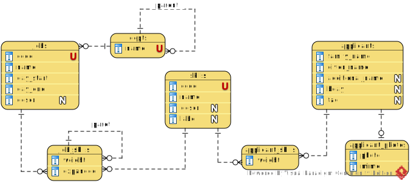

[En français](https://github.com/ciukstar/candidate/blob/master/README.fr.md)  
[În română](https://github.com/ciukstar/candidate/blob/master/README.ro.md)  
[На русском](https://github.com/ciukstar/candidate/blob/master/README.ru.md)

# Candidate Ranking

This application provides a simple method for aggregating hierarchical rankings. The application helps to make decisions about the selection of candidates based on a hierarchy of attributes, skills and their weight.

## Overview

The skills required by a job position should be defined in the dictionary [Skills](https://candidate-i4rimw5qwq-de.a.run.app/skills?desc=id&offset=0&limit=5).

Job positions and their required skills are defined in the section [Positions](https://candidate-i4rimw5qwq-de.a.run.app/jobs?desc=id&offset=0&limit=5).

Applicants and their skills are added in the section [Applicants](https://candidate-i4rimw5qwq-de.a.run.app/applicants?desc=id&offset=0&limit=5).

For each position, the rating of candidates is calculated and the result is available at the link "Candidate". See [Positions](https://candidate-i4rimw5qwq-de.a.run.app/job-candidates/2).

Also in the "Candidates" section, more options are provided for calculating the rating of candidates. See [Candidates](https://candidate-i4rimw5qwq-de.a.run.app/candidates).

## Basic Entities

### Skill

A Skill is identified by a short code. It has a name and a description. A Skill may be an attribute of a Position and/or of an Applicant.

### Position

A Position is identified by a code. It is assigned a name, a start date, end date and optionally a division. Also, it has a many-to-many relationship with Skills. Each relationship "Position - Skill" is assigned the weight of the Skill or group. Skills may be grouped. And the groups may be further grouped in a hierarchy.

### Applicant

An Applicant is the entity whose Skills will be matched against the Skills required for a Position.

### Candidate

A Candidate is an Applicant whose Skills have been compared to those of a particular Position and for whom an aggregate weight (rating) is calculated to distinguish him from other applicants for the same position.

*Entity Relationship Diagram*

# Demo

[Click here to see demo](https://candidate-i4rimw5qwq-de.a.run.app)
