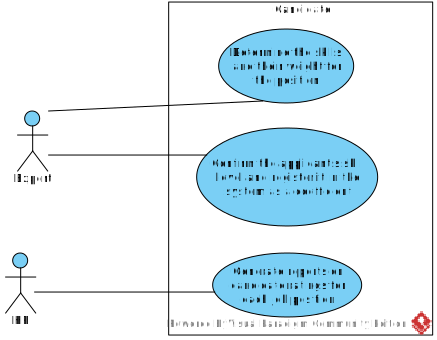

[In English](https://github.com/ciukstar/candidate/blob/master/README.md)  
[En français](https://github.com/ciukstar/candidate/blob/master/README.fr.md)  
[На русском](https://github.com/ciukstar/candidate/blob/master/README.ru.md)

# Clasamentul candidaților

Această aplicație oferă o metodă simplă de agregare a clasamentelor ierarhice. 

Aplicația ajută la luarea deciziilor cu privire la selecția candidaților pe baza unei ierarhii de atribute, abilități și ponderea acestora.

## Prezentare generală

*Diagrama cazurilor de utilizare*  

Abilitățile cerute de un loc de muncă ar trebui să fie definite în dicționar [Aptitudini](https://candidatero-i4rimw5qwq-de.a.run.app/skills?desc=id&offset=0&limit=5).

Posturile de muncă și competențele lor necesare sunt definite în secțiune [Poziții](https://candidatero-i4rimw5qwq-de.a.run.app/jobs?desc=id&offset=0&limit=5).

Solicitanții și abilitățile lor sunt adăugate în secțiune [Solicitanţi](https://candidatero-i4rimw5qwq-de.a.run.app/applicants?desc=id&offset=0&limit=5).

Pentru fiecare post se calculează ratingul candidaților, iar rezultatul este disponibil la linkul „Candidat”. Vezi [Poziții](https://candidatero-i4rimw5qwq-de.a.run.app/job-candidates/2).

Tot în secțiunea „Candidați” sunt oferite mai multe opțiuni pentru calcularea ratingului candidaților. Vezi [Candidați](https://candidatero-i4rimw5qwq-de.a.run.app/candidates).

## Entități de bază

### Aptitudine

O abilitate este identificată printr-un cod scurt. Are un nume și o descriere. O abilitate poate fi un atribut al unei poziții și/sau al unui solicitant.

### Poziţie

O Poziție este identificată printr-un cod. I se atribuie un nume, o dată de început, o dată de încheiere și opțional o diviziune. De asemenea, are o relație multi-la-mulți cu Skills. Fiecărei relații „Poziție – Abilitate” i se atribuie ponderea Abilității sau a grupului. Abilitățile pot fi grupate. Și grupurile pot fi grupate în continuare într-o ierarhie.

### Solicitant

Un solicitant este entitatea ale cărei abilități vor fi comparate cu abilitățile necesare pentru o poziție.

### Candidat

Un candidat este un solicitant ale cărui abilități au fost comparate cu cele ale unei anumite poziții și pentru care se calculează o pondere (evaluare) agregată pentru a-l diferenția de alți candidați pentru aceeași poziție.

*Diagrama relație-entitate*  

# Demo

[Click here to see demo](https://candidatero-i4rimw5qwq-de.a.run.app)
