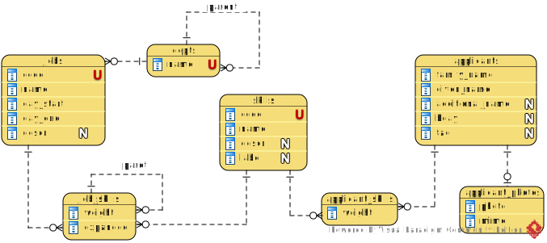

[In English](https://github.com/ciukstar/candidate/blob/master/README.md)  
[En français](https://github.com/ciukstar/candidate/blob/master/README.fr.md)  
[În română](https://github.com/ciukstar/candidate/blob/master/README.ro.md)

# Ранжирование кандидатов

Это приложение предоставляет простой метод объединения (агрегации) иерархических ранжирований. Приложение помогает принимать решения о подборе кандидатов на основе иерархии атрибутов, навыков и их веса.

## Обзор

Навыки, необходимые для должности, должны быть определены в словаре [Навыки](https://candidateru-i4rimw5qwq-de.a.run.app/skills?desc=id&offset=0&limit=5).

Должности и требуемые для них навыки определены в разделе [Должности](https://candidateru-i4rimw5qwq-de.a.run.app/jobs?desc=id&offset=0&limit=5).

Соискатели и их навыки добавляются в раздел [Соискатели](https://candidateru-i4rimw5qwq-de.a.run.app/applicants?desc=id&offset=0&limit=5).

Для каждой должности рассчитывается рейтинг кандидатов и результат доступен по ссылке «Кандидат». См. [Должности](https://candidateru-i4rimw5qwq-de.a.run.app/job-candidates/2).

Также в разделе «Кандидаты» предоставлено больше возможностей для расчета рейтинга кандидатов. См. [Кандидаты](https://candidateru-i4rimw5qwq-de.a.run.app/candidates).

## Основные сущности

### Навык

Навык идентифицируется коротким кодом. У него есть имя и описание. Навык может быть атрибутом должности и/или соискателя.

### Должность

Должность определяется кодом. Ему присваивается имя, дата начала, дата окончания и, возможно, подразделение. Кроме того, Должность имеет отношение «многие ко многим» с Навыками. Каждой связи «Должность — Навык» присваивается вес Навыка или группы. Навыки могут быть сгруппированы. И группы могут быть дополнительно сгруппированы в иерархию.

### Соискатель

Соискатель — это сущность, чьи Навыки будут сопоставлены с Навыками, необходимыми для Должности.

### Кандидат

Кандидат — это Соискатель, чьи Навыки были сопоставлены с Навыками конкретной Должности, и для которого рассчитывается совокупный Вес (рейтинг), чтобы отличить его от других Соискателей на ту же Должность.

*Диаграмма отношений сущностей*

# Демонстрация приложения

[Нажмите здесь, чтобы увидеть демонстрацию](https://candidateru-i4rimw5qwq-de.a.run.app)
